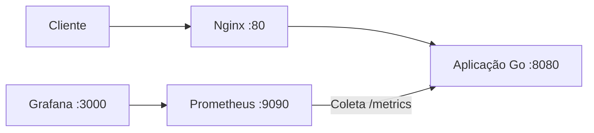

# HTTP Server Projeto Korp


Projeto DevOps desenvolvido como desafio técnico utilizando Go, Docker, Docker Compose, Nginx, Prometheus, Grafana, Ansible e GitHub Actions.

O objetivo é disponibilizar uma aplicação HTTP simples, containerizada e observável, com proxy reverso, coleta de métricas, dashboard de monitoramento, automação de provisionamento e pipeline de integração contínua.

## Arquitetura

Fluxo principal da solução:



Fluxo simplificado:

```text
Cliente
   |
   v
Nginx
   |
   v
Aplicação Go
   |
   +------> /health
   |
   +------> /metrics
               |
               v
           Prometheus
               |
               v
            Grafana
```

## Tecnologias

- Go 1.22
- Docker
- Docker Compose
- Nginx
- Prometheus
- Grafana
- Ansible
- Git
- GitHub
- GitHub Actions

## Funcionalidades

- Servidor HTTP desenvolvido em Go
- Endpoint principal da aplicação
- Health Check
- Endpoint de métricas compatível com Prometheus
- Proxy reverso com Nginx
- Monitoramento com Prometheus
- Dashboard com Grafana
- Provisionamento automatizado com Ansible
- Execução dos serviços com Docker Compose
- Pipeline de integração contínua com GitHub Actions

## Estrutura do Projeto

```text
http-server-projeto-korp/
├── .github/
│   └── workflows/
│       └── ci.yml
├── ansible/
│   └── playbook.yml
├── cmd/
│   └── server/
│       └── main.go
├── docs/
│   └── images/
│       ├── ansible-success.png
│       ├── docker-compose-ps.png
│       ├── github-actions-success.png
│       ├── grafana-dashboard.png
│       └── prometheus-query.png
├── internal/
│   └── server/
│       └── server.go
├── monitoring/
│   ├── grafana/
│   │   └── provisioning/
│   │       ├── dashboards/
│   │       │   └── dashboard.yml
│   │       └── datasources/
│   │           └── datasource.yml
│   └── prometheus/
│       └── prometheus.yml
├── nginx/
│   └── conf.d/
│       └── default.conf
├── .gitignore
├── Dockerfile
├── docker-compose.yml
├── go.mod
├── go.sum
└── README.md
```

## Executando o Projeto

### Subir todos os serviços

```bash
sudo docker compose up --build
```

Esse comando executa os containers mostrando os logs diretamente no terminal.

### Executar em segundo plano

```bash
sudo docker compose up -d --build
```

A opção `-d` executa os containers em segundo plano e libera o terminal para outros comandos.

### Verificar os containers

```bash
sudo docker compose ps
```

### Visualizar logs

```bash
sudo docker compose logs -f
```

Para sair dos logs sem parar os containers:

```text
Ctrl + C
```

### Parar os serviços

```bash
sudo docker compose down
```

## Serviços e Endpoints

| Serviço | URL |
|---|---|
| Aplicação | http://localhost |
| Health Check | http://localhost/health |
| Métricas | http://localhost/metrics |
| Prometheus | http://localhost:9090 |
| Grafana | http://localhost:3000 |

## Aplicação

A aplicação HTTP é desenvolvida em Go e executa internamente na porta:

```text
8080
```

O acesso externo é realizado através do Nginx na porta:

```text
80
```

### Endpoint principal

```text
http://localhost
```

Resposta esperada:

```text
HTTP Server Projeto Korp funcionando!
```

Teste:

```bash
curl http://localhost
```

## Health Check

O endpoint:

```text
/health
```

permite verificar a disponibilidade da aplicação.

Teste:

```bash
curl http://localhost/health
```

Resposta esperada:

```text
OK
```

## Métricas

A aplicação disponibiliza métricas compatíveis com Prometheus através do endpoint:

```text
/metrics
```

Teste:

```bash
curl http://localhost/metrics
```

Uma das principais métricas utilizadas é:

```text
http_requests_total
```

Ela representa o total de requisições HTTP recebidas pela aplicação.

Para consultar apenas essa métrica:

```bash
curl -s http://localhost/metrics | grep http_requests_total
```

Resultado esperado semelhante a:

```text
# HELP http_requests_total Total de requisições HTTP recebidas
# TYPE http_requests_total counter
http_requests_total 2
```

O valor pode variar de acordo com a quantidade de requisições realizadas.

## Nginx

O Nginx atua como proxy reverso.

O fluxo de acesso é:

```text
Cliente
   |
   v
Nginx :80
   |
   v
Aplicação Go :8080
```

A configuração está localizada em:

```text
nginx/conf.d/default.conf
```

## Prometheus

O Prometheus é responsável por coletar as métricas expostas pela aplicação.

A interface pode ser acessada em:

```text
http://localhost:9090
```

Exemplo de consulta:

```promql
http_requests_total
```

O Prometheus coleta os dados a partir do endpoint:

```text
app:8080/metrics
```

## Grafana

O Grafana utiliza o Prometheus como fonte de dados para construção dos dashboards.

A interface pode ser acessada em:

```text
http://localhost:3000
```

## Dashboard de Observabilidade

O dashboard desenvolvido contém os seguintes painéis:

- Taxa de Requisições HTTP
- Total de Requisições HTTP
- Goroutines Ativas
- Memória em Uso
- Status da Aplicação

### Taxa de Requisições HTTP

Query:

```promql
rate(http_requests_total[1m])
```

Essa consulta apresenta a taxa de requisições por segundo.

### Total de Requisições HTTP

Query:

```promql
http_requests_total
```

Apresenta o total acumulado de requisições.

### Goroutines Ativas

Query:

```promql
go_goroutines
```

Apresenta a quantidade de goroutines ativas na aplicação Go.

### Memória em Uso

Query:

```promql
process_resident_memory_bytes
```

No Grafana, a unidade utilizada é:

```text
bytes (IEC)
```

permitindo visualizar valores como:

```text
14.0 MiB
```

### Status da Aplicação

Query:

```promql
up{job="http-server-korp"}
```

Foi configurado um Value Mapping no Grafana:

```text
1 = UP
0 = DOWN
```

Assim o dashboard apresenta:

```text
UP
```

quando o serviço está disponível.

## Ansible

O projeto utiliza Ansible para automatizar o provisionamento básico do ambiente.

O playbook está localizado em:

```text
ansible/playbook.yml
```

### Validar a sintaxe

```bash
ansible-playbook ansible/playbook.yml --syntax-check
```

### Executar o playbook

```bash
sudo ansible-playbook ansible/playbook.yml
```

### Executar em modo de verificação

```bash
sudo ansible-playbook ansible/playbook.yml --check
```

O playbook executa:

- atualização do cache do APT;
- instalação do Docker;
- instalação do Docker Compose;
- inicialização do Docker;
- habilitação do serviço Docker;
- inclusão do usuário no grupo Docker.

Uma execução válida deve terminar com:

```text
unreachable=0
failed=0
```

## Integração Contínua

O projeto utiliza GitHub Actions para validar automaticamente o código.

O workflow está localizado em:

```text
.github/workflows/ci.yml
```

A pipeline é executada automaticamente em:

- push para a branch `main`;
- pull request para a branch `main`.

## Validações da Pipeline

O GitHub Actions executa:

- Checkout do código
- Configuração do Go
- Validação das dependências
- Verificação de formatação com `gofmt`
- Execução de testes com `go test`
- Compilação da aplicação
- Validação do Docker Compose
- Build da imagem Docker

A pipeline pode ser acompanhada através da aba:

```text
Actions
```

do repositório no GitHub.

## Validação Local

### Formatar código Go

```bash
gofmt -w cmd/server/main.go internal/server/server.go
```

### Executar testes

```bash
go test ./...
```

### Compilar a aplicação

```bash
go build ./cmd/server
```

### Validar Docker Compose

```bash
docker compose config
```

### Construir a imagem Docker

```bash
docker build -t http-server-projeto-korp:test .
```

## Testes Manuais

### Aplicação

```bash
curl http://localhost
```

Resultado esperado:

```text
HTTP Server Projeto Korp funcionando!
```

### Health Check

```bash
curl http://localhost/health
```

Resultado esperado:

```text
OK
```

### Métricas

```bash
curl -s http://localhost/metrics | grep http_requests_total
```

Resultado esperado semelhante a:

```text
# HELP http_requests_total Total de requisições HTTP recebidas
# TYPE http_requests_total counter
http_requests_total 2
```

## Evidências

### Dashboard Grafana

Dashboard de observabilidade da aplicação com métricas de requisições, goroutines, memória e disponibilidade.


### Prometheus

Consulta da métrica customizada `http_requests_total` coletada da aplicação Go.


### GitHub Actions

Pipeline de integração contínua executada com sucesso no GitHub Actions.


### Docker Compose

Containers da aplicação, Nginx, Prometheus e Grafana em execução.


### Ansible

Execução do playbook Ansible validada com:

```text
unreachable=0
failed=0
```


## Status do Projeto

Os principais componentes foram implementados e validados:

- Aplicação Go
- Docker
- Docker Compose
- Nginx
- Prometheus
- Grafana
- Dashboard de observabilidade
- Health Check
- Métricas HTTP
- Ansible
- GitHub Actions

## Autor

Paulo Barbosa