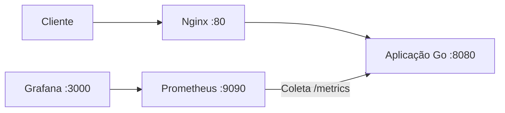
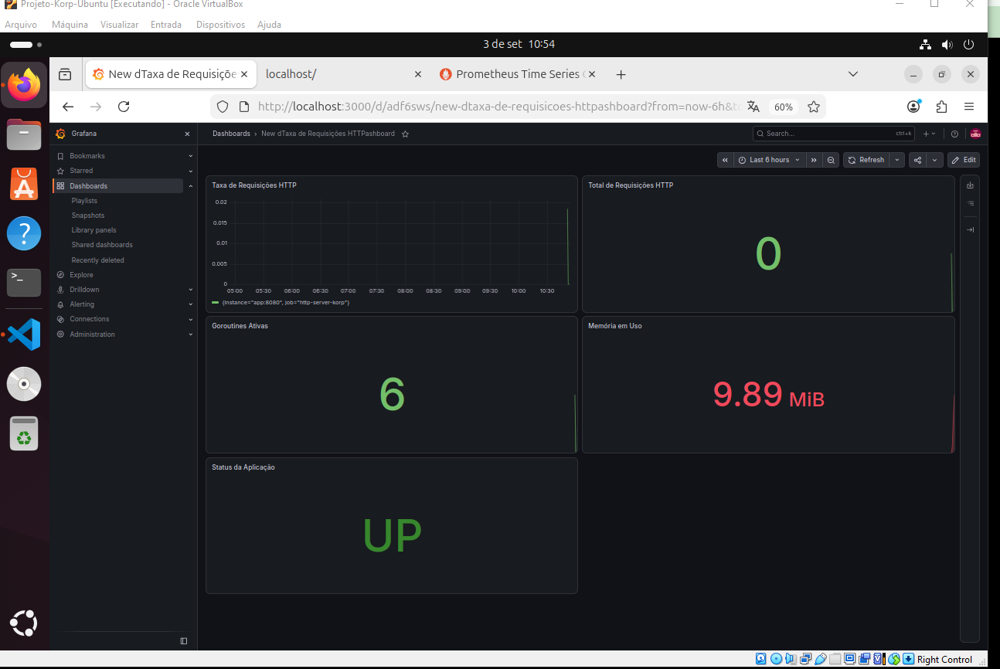
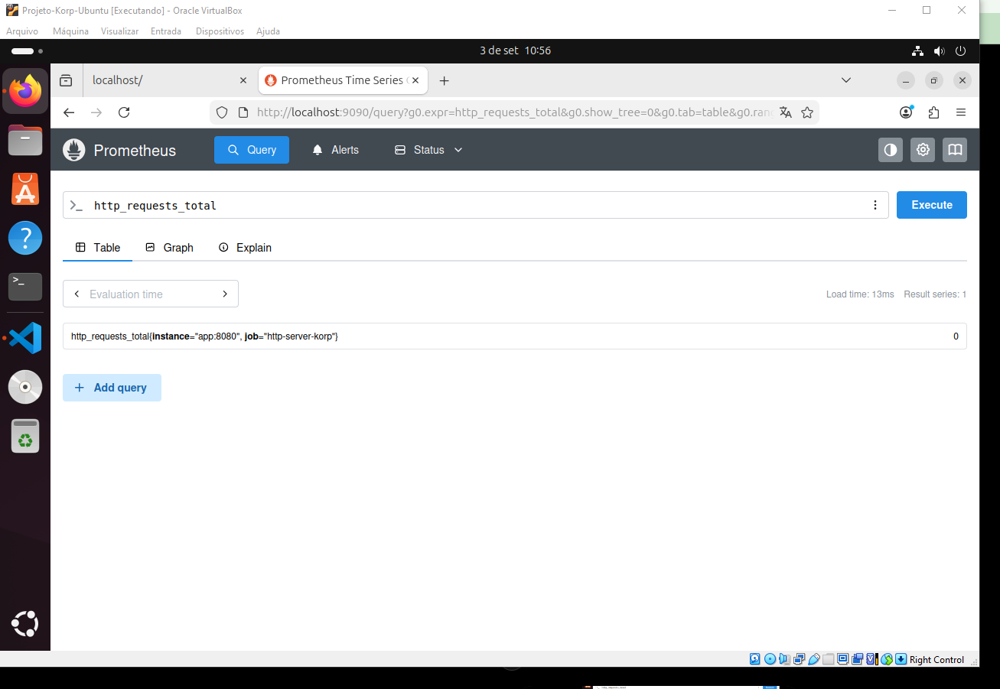
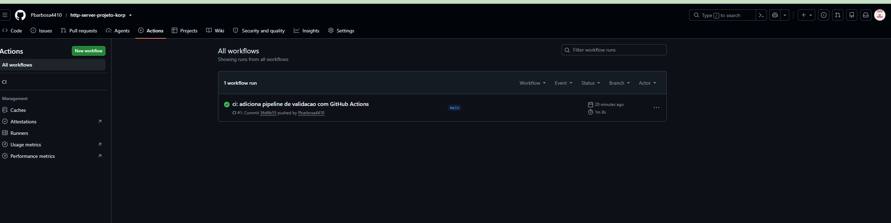
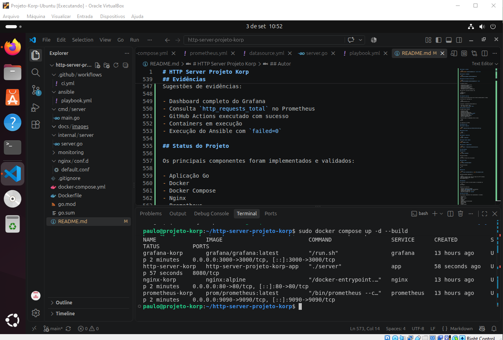
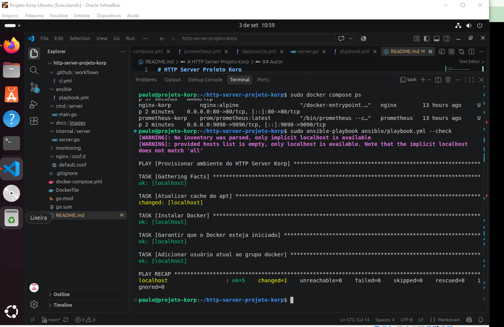

# HTTP Server Projeto Korp


Projeto DevOps desenvolvido como desafio técnico utilizando Go, Docker, Docker Compose, Nginx, Prometheus, Grafana, Ansible e GitHub Actions.

O objetivo é disponibilizar uma aplicação HTTP simples, containerizada, observável e automatizada, com proxy reverso, coleta de métricas, dashboard de monitoramento, provisionamento com Ansible e pipeline de integração contínua.

---

## Arquitetura

Fluxo principal da solução:



Fluxo simplificado:

```text
Cliente
   |
   v
Nginx :80
   |
   v
Aplicação Go :8080
   |
   +------> /projeto-korp
   |
   +------> /health
   |
   +------> /metrics
               |
               v
           Prometheus
               |
               v
            Grafana
```

---

## Tecnologias

- Go 1.22
- Docker
- Docker Compose
- Nginx
- Prometheus
- Grafana
- Ansible
- Git
- GitHub
- GitHub Actions
- Make

---

## Funcionalidades

- Servidor HTTP desenvolvido em Go
- Endpoint obrigatório `GET /projeto-korp`
- Resposta JSON com nome do projeto e horário UTC
- Health Check
- Métricas no padrão Prometheus
- Proxy reverso com Nginx
- Rede Docker bridge dedicada
- Monitoramento com Prometheus
- Dashboard com Grafana
- Provisionamento automatizado com Ansible
- Execução dos serviços com Docker Compose
- Pipeline de integração contínua com GitHub Actions
- Testes automatizados
- Automação de comandos com Makefile

---

## Estrutura do Projeto

```text
http-server-projeto-korp/
├── .github/
│   └── workflows/
│       └── ci.yml
├── ansible/
│   └── playbook.yml
├── cmd/
│   └── server/
│       └── main.go
├── docs/
│   └── images/
│       ├── ansible-success.png
│       ├── docker-compose-ps.png
│       ├── github-actions-success.png
│       ├── grafana-dashboard.png
│       └── prometheus-query.png
├── internal/
│   └── server/
│       ├── server.go
│       └── server_test.go
├── monitoring/
│   ├── grafana/
│   │   └── provisioning/
│   │       ├── dashboards/
│   │       │   └── dashboard.yml
│   │       └── datasources/
│   │           └── datasource.yml
│   └── prometheus/
│       └── prometheus.yml
├── nginx/
│   └── conf.d/
│       └── http-server-projeto-korp.conf
├── .gitignore
├── Dockerfile
├── docker-compose.yml
├── go.mod
├── go.sum
├── Makefile
└── README.md
```

---

## Serviço HTTP

A aplicação é executada internamente na porta:

```text
8080
```

O serviço não publica diretamente essa porta no host.

O acesso externo ocorre através do Nginx na porta:

```text
80
```

---

## Endpoint obrigatório

O desafio exige o endpoint:

```text
GET /projeto-korp
```

Acesso:

```text
http://localhost:80/projeto-korp
```

Teste:

```bash
curl http://localhost:80/projeto-korp
```

Resposta esperada:

```json
{
  "nome": "Projeto Korp",
  "horario": "2026-09-03T19:14:40Z"
}
```

O campo:

```text
horario
```

é calculado dinamicamente a cada requisição utilizando horário UTC.

A aplicação utiliza:

```go
time.Now().UTC()
```

com formatação RFC3339.

---

## Health Check

O endpoint:

```text
/health
```

é utilizado para verificar a disponibilidade da aplicação.

Teste:

```bash
curl http://localhost:80/health
```

Resposta esperada:

```text
OK
```

---

## Métricas

A aplicação disponibiliza métricas no padrão Prometheus através do endpoint:

```text
/metrics
```

Teste:

```bash
curl http://localhost:80/metrics
```

A principal métrica customizada é:

```text
http_requests_total
```

Ela representa o total de requisições HTTP recebidas.

Consulta:

```bash
curl -s http://localhost:80/metrics | grep http_requests_total
```

Resultado semelhante a:

```text
# HELP http_requests_total Total de requisições HTTP recebidas
# TYPE http_requests_total counter
http_requests_total 2
```

---

## Docker

A aplicação possui um `Dockerfile` responsável pelo build e execução do serviço Go.

O container da aplicação utiliza internamente:

```text
8080
```

sem publicar a porta diretamente no host.

---

## Rede Docker

O ambiente utiliza uma rede Docker dedicada:

```text
korp-network
```

Tipo:

```text
bridge
```

A rede é declarada no `docker-compose.yml`:

```yaml
networks:
  korp-network:
    name: korp-network
    driver: bridge
```

Os seguintes serviços utilizam essa rede:

- aplicação Go
- Nginx
- Prometheus
- Grafana

Para consultar a rede:

```bash
sudo docker network ls
```

Resultado esperado:

```text
korp-network    bridge
```

---

## Docker Compose

O Docker Compose é responsável por executar os serviços:

- `http-server-korp`
- `nginx-korp`
- `prometheus-korp`
- `grafana-korp`

### Subir os serviços

```bash
sudo docker compose up -d --build
```

### Visualizar os serviços

```bash
sudo docker compose ps
```

### Parar os serviços

```bash
sudo docker compose down
```

### Validar configuração

```bash
sudo docker compose config
```

---

## Nginx

O Nginx atua como proxy reverso.

A configuração está localizada em:

```text
nginx/conf.d/http-server-projeto-korp.conf
```

O diretório:

```text
nginx/conf.d
```

é montado no container no caminho:

```text
/etc/nginx/conf.d
```

Fluxo:

```text
Cliente
   |
   v
localhost:80
   |
   v
Nginx
   |
   v
app:8080
```

O Nginx encaminha as requisições para:

```text
http://app:8080
```

Teste obrigatório do desafio:

```bash
curl http://localhost:80/projeto-korp
```

---

## Prometheus

O Prometheus coleta as métricas expostas pela aplicação.

Interface:

```text
http://localhost:9090
```

O alvo configurado é:

```text
app:8080
```

Endpoint coletado:

```text
/metrics
```

Exemplo de consulta:

```promql
http_requests_total
```

Para validar disponibilidade:

```promql
up{job="http-server-korp"}
```

Valor esperado:

```text
1
```

---

## Grafana

O Grafana utiliza o Prometheus como fonte de dados.

Interface:

```text
http://localhost:3000
```

O datasource Prometheus é provisionado automaticamente através de:

```text
monitoring/grafana/provisioning/datasources/datasource.yml
```

---

## Dashboard de Observabilidade

O dashboard desenvolvido possui os seguintes painéis:

- Taxa de Requisições HTTP
- Total de Requisições HTTP
- Goroutines Ativas
- Memória em Uso
- Status da Aplicação

### Taxa de Requisições HTTP

```promql
rate(http_requests_total[1m])
```

### Total de Requisições HTTP

```promql
http_requests_total
```

### Goroutines Ativas

```promql
go_goroutines
```

### Memória em Uso

```promql
process_resident_memory_bytes
```

Unidade utilizada no Grafana:

```text
bytes (IEC)
```

### Status da Aplicação

```promql
up{job="http-server-korp"}
```

Value Mapping:

```text
1 = UP
0 = DOWN
```

---

## Automação com Ansible

O playbook está localizado em:

```text
ansible/playbook.yml
```

O objetivo é provisionar todo o ambiente utilizando um único comando.

### O playbook realiza

- atualização do cache APT;
- instalação do Docker;
- inicialização e habilitação do Docker;
- validação do Docker Compose;
- criação da rede Docker bridge;
- validação da configuração Compose;
- build da aplicação;
- execução dos containers;
- configuração do Nginx;
- execução do Prometheus;
- execução do Grafana;
- validação do endpoint `/projeto-korp`;
- exibição da resposta JSON no console;
- validação do endpoint `/health`;
- validação do Prometheus;
- validação do Grafana;
- exibição dos containers em execução.

---

## Provisionamento completo com um único comando

Executar:

```bash
ansible-playbook ansible/playbook.yml
```

Caso seja necessário solicitar senha para elevação de privilégio:

```bash
ansible-playbook ansible/playbook.yml --ask-become-pass
```

### Validação da sintaxe

```bash
ansible-playbook ansible/playbook.yml --syntax-check
```

Resultado esperado:

```text
playbook: ansible/playbook.yml
```

---

## Validação do serviço pelo Ansible

Durante a execução, o playbook realiza:

```text
GET http://localhost:80/projeto-korp
```

e exibe no console uma resposta semelhante a:

```json
{
  "nome": "Projeto Korp",
  "horario": "2026-09-03T19:14:40Z"
}
```

Também é validado:

```text
http://localhost:80/health
```

com resposta:

```text
OK
```

---

## Resultado esperado do Ansible

Uma execução bem-sucedida deve terminar com:

```text
PLAY RECAP
localhost : ok=... changed=... unreachable=0 failed=0
```

Exemplo validado durante o desenvolvimento:

```text
localhost : ok=20 changed=3 unreachable=0 failed=0
```

O playbook também exibe:

```text
Ambiente provisionado com sucesso.
Aplicação: http://localhost:80/projeto-korp
Health Check: http://localhost:80/health
Prometheus: http://localhost:9090
Grafana: http://localhost:3000
```

---

## Testes Automatizados

Os testes estão localizados em:

```text
internal/server/server_test.go
```

São validados:

- `/`
- `/projeto-korp`
- método HTTP permitido no `/projeto-korp`
- JSON retornado
- campo `nome`
- campo `horario`
- horário UTC
- `/health`
- `/metrics`

### Executar

```bash
go test ./...
```

### Executar em modo detalhado

```bash
go test -v ./...
```

Resultado esperado:

```text
=== RUN   TestRootEndpoint
--- PASS: TestRootEndpoint

=== RUN   TestProjetoKorpEndpoint
--- PASS: TestProjetoKorpEndpoint

=== RUN   TestProjetoKorpSomenteGET
--- PASS: TestProjetoKorpSomenteGET

=== RUN   TestHealthEndpoint
--- PASS: TestHealthEndpoint

=== RUN   TestMetricsEndpoint
--- PASS: TestMetricsEndpoint

PASS
```

---

## GitHub Actions

O projeto utiliza GitHub Actions para integração contínua.

Workflow:

```text
.github/workflows/ci.yml
```

A pipeline executa:

- checkout do código;
- configuração do Go;
- validação de dependências;
- validação de formatação;
- testes automatizados;
- compilação;
- validação do Docker Compose;
- build da imagem Docker.

A pipeline é executada automaticamente em:

- push para `main`;
- pull requests para `main`.

---

## Makefile

O projeto possui um `Makefile` para facilitar as operações locais.

### Comandos disponíveis

```text
make up
make down
make test
make build
make fmt
make ps
make logs
make compose-check
make docker-build
```

### Resumo

| Comando | Finalidade |
|---|---|
| `make up` | Build e inicialização dos serviços |
| `make down` | Parar os serviços |
| `make test` | Executar testes automatizados |
| `make build` | Compilar a aplicação Go |
| `make fmt` | Formatar código |
| `make ps` | Exibir containers |
| `make logs` | Acompanhar logs |
| `make compose-check` | Validar Docker Compose |
| `make docker-build` | Construir imagem Docker |

---

## Teste de Aceite

### Subir ambiente

```bash
sudo docker compose up -d --build
```

### Validar containers

```bash
sudo docker compose ps
```

### Validar endpoint obrigatório

```bash
curl http://localhost:80/projeto-korp
```

### Validar health check

```bash
curl http://localhost:80/health
```

### Validar métricas

```bash
curl -s http://localhost:80/metrics | grep http_requests_total
```

### Executar testes

```bash
go test -v ./...
```

### Validar Compose

```bash
sudo docker compose config
```

### Executar provisionamento Ansible

```bash
ansible-playbook ansible/playbook.yml
```

---

## Evidências

### Dashboard Grafana

Dashboard de observabilidade contendo métricas de requisições, goroutines, memória e disponibilidade.



### Prometheus

Consulta da métrica:

```text
http_requests_total
```



### GitHub Actions

Pipeline de integração contínua executada com sucesso.



### Docker Compose

Containers do ambiente em execução.



### Ansible

Execução do playbook concluída com:

```text
unreachable=0
failed=0
```



---

## Status do Projeto

Componentes implementados e validados:

- Aplicação Go
- Endpoint `/projeto-korp`
- JSON dinâmico
- Horário UTC
- Docker
- Docker Compose
- Rede bridge `korp-network`
- Nginx
- Proxy reverso
- Prometheus
- Grafana
- Dashboard de observabilidade
- Health Check
- Métricas HTTP
- Testes automatizados
- Ansible
- Provisionamento completo por Ansible
- GitHub Actions
- Makefile
- Documentação
- Evidências

---

## Release

Versão estável inicial:

```text
v1.0.0
```

Após os ajustes finais de aderência ao desafio, será disponibilizada uma nova versão corrigida.

---

## Autor

Paulo Barbosa